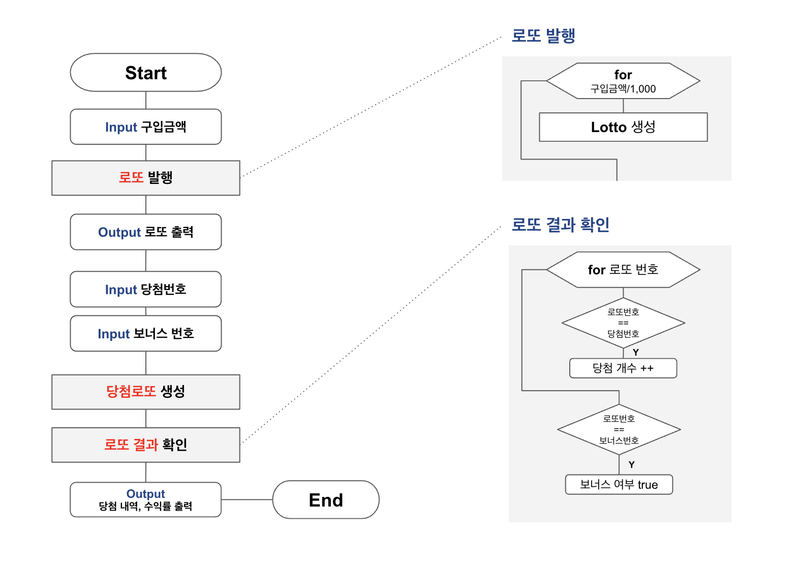

# 기능 목록

## 로또 구입
- [x] 구입 금액 입력 문구를 출력하는 기능
- [x] 구입 금액 입력 받는 기능
  - [x] 입력한 값이 숫자인지 예외 처리하는 기능
  - [x] 1000원 단위로 나누어 떨어지는지 예외 처리하는 기능
  - [x] 표현하지 못할 정도로 큰 금액을 입력할 시 예외 처리하는 기능
  - [x] 예외 처리되고 다시 입력 받는 기능
- [x] 구입한 로또 수를 출력하는 기능

## 로또 생성
- [x] 구입한 로또 수만큼 로또를 생성하는 기능
  - [x] 6개의 1-45 범위 숫자를 랜덤으로 뽑는 기능
    - [x] 랜덤으로 뽑았을 때 중복된 숫자가 있는지 검사하는 기능
- [x] 오름차순으로 정렬하는 기능
- [x] 로또 번호들을 출력하는 기능

## 당첨 번호 생성
- [x] 당첨 번호 입력 문구를 출력하는 기능
- [x] 당첨 번호 입력 받는 기능
  - [x] 당첨 번호를 쉼표로 구분하는 기능
    - [x] 당첨 번호 개수가 6인지 예외 처리하는 기능
    - [x] 당첨 번호가 1-45 범위의 숫자인지 예외 처리하는 기능
    - [x] 당첨 번호들이 중복되지 않았는지 예외 처리하는 기능
    - [x] 예외 처리되고 다시 입력 받는 기능

## 보너스 번호 생성
- [x] 보너스 번호 입력 문구를 출력하는 기능
- [x] 보너스 번호를 입력받는 기능
  - [x] 보너스 번호가 1-45 범위의 숫자인지 예외 처리하는 기능
  - [x] 보너스 번호가 당첨 번호에 속하는지 예외 처리하는 기능
  - [x] 예외 처리되고 다시 입력 받는 기능

## 당첨 통계 계산
- [x] 로또 수만큼 당첨 등수를 계산하는 기능 
  - [x] 일치하는 당첨 번호 갯수를 계산하는 기능
  - [x] 보너스 번호가 포함되어 있는지 계산하는 기능
  - [x] 당첨 번호 갯수와 보너스 포함 여부로 등수를 계산하는 기능
    - [x] 해당 등수를 카운트하는 기능
- [x] 당첨 통계를 출력하는 기능
  - [x] 당첨 통계 시작 문구 출력 기능
  - [x] 순위 마다 통계를 출력하는 기능

## 로또 수익률 계산
- [x] 로또의 수익률을 계산하는 기능
  - [x] 수익률을 소수점 둘째자리에서 반올림하는 기능
- [x] 로또의 수익률을 출력하는 기능

# 실행 흐름도
